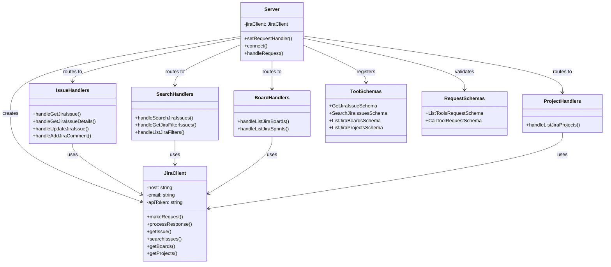
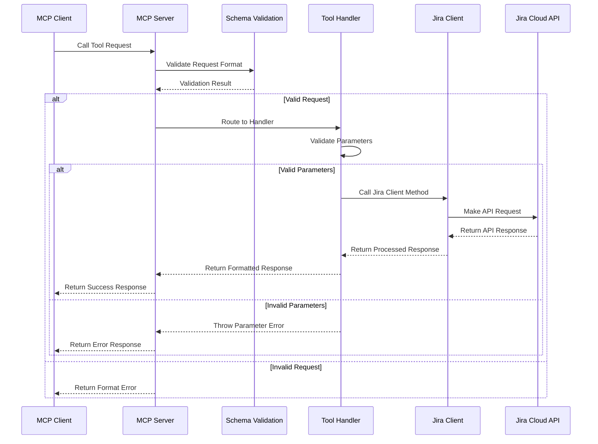
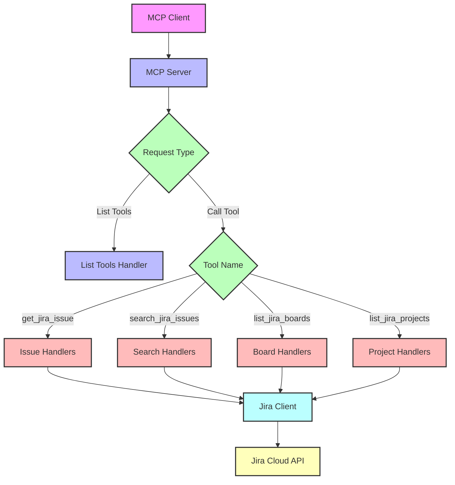
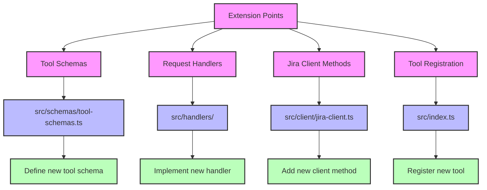
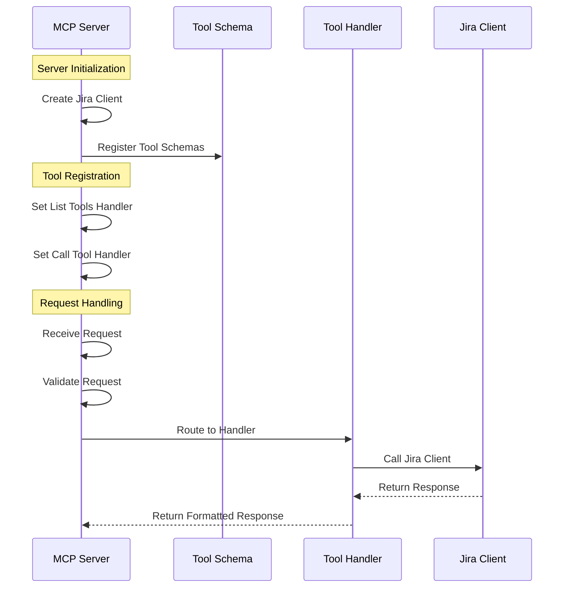

# MCP Component Relationships

This document provides comprehensive diagrams that illustrate the relationships between the different components of the Jira Cloud MCP Server. These diagrams help visualize how the components interact and how to extend the server with new functionality.

## Table of Contents

1. [Introduction](#introduction)
2. [Component Overview](#component-overview)
3. [Request Flow Diagram](#request-flow-diagram)
4. [Component Interaction Diagram](#component-interaction-diagram)
5. [Extension Points Diagram](#extension-points-diagram)
6. [Tool Registration Diagram](#tool-registration-diagram)

## Introduction

Understanding the relationships between components is essential for extending the Jira Cloud MCP Server. This document provides visual representations of these relationships to complement the written documentation.

## Component Overview

This diagram provides an overview of the main components of the Jira Cloud MCP Server:



## Request Flow Diagram

This diagram illustrates the flow of a request through the MCP server:



## Component Interaction Diagram

This diagram illustrates how the different components interact during a request:



## Extension Points Diagram

This diagram illustrates the extension points for adding new functionality to the MCP server:



## Tool Registration Diagram

This diagram illustrates how tools are registered with the MCP server:



## Adding a New Tool

This diagram illustrates the process of adding a new tool to the MCP server:

```mermaid
flowchart TD
    A[Start] --> B[Define Tool Schema]
    B --> C[Implement Handler]
    C --> D[Add Jira Client Method]
    D --> E[Register Tool]
    E --> F[Test Tool]
    F --> G[Document Tool]
    G --> H[End]
    
    classDef start fill:#f9f,stroke:#333,stroke-width:2px
    classDef schema fill:#bbf,stroke:#333,stroke-width:2px
    classDef handler fill:#bfb,stroke:#333,stroke-width:2px
    classDef client fill:#fbb,stroke:#333,stroke-width:2px
    classDef register fill:#bff,stroke:#333,stroke-width:2px
    classDef test fill:#ffb,stroke:#333,stroke-width:2px
    classDef document fill:#fbf,stroke:#333,stroke-width:2px
    classDef end fill:#f9f,stroke:#333,stroke-width:2px
    
    A:::start
    B:::schema
    C:::handler
    D:::client
    E:::register
    F:::test
    G:::document
    H:::end
```

Last updated: 2025-03-07 at 13:13:06
