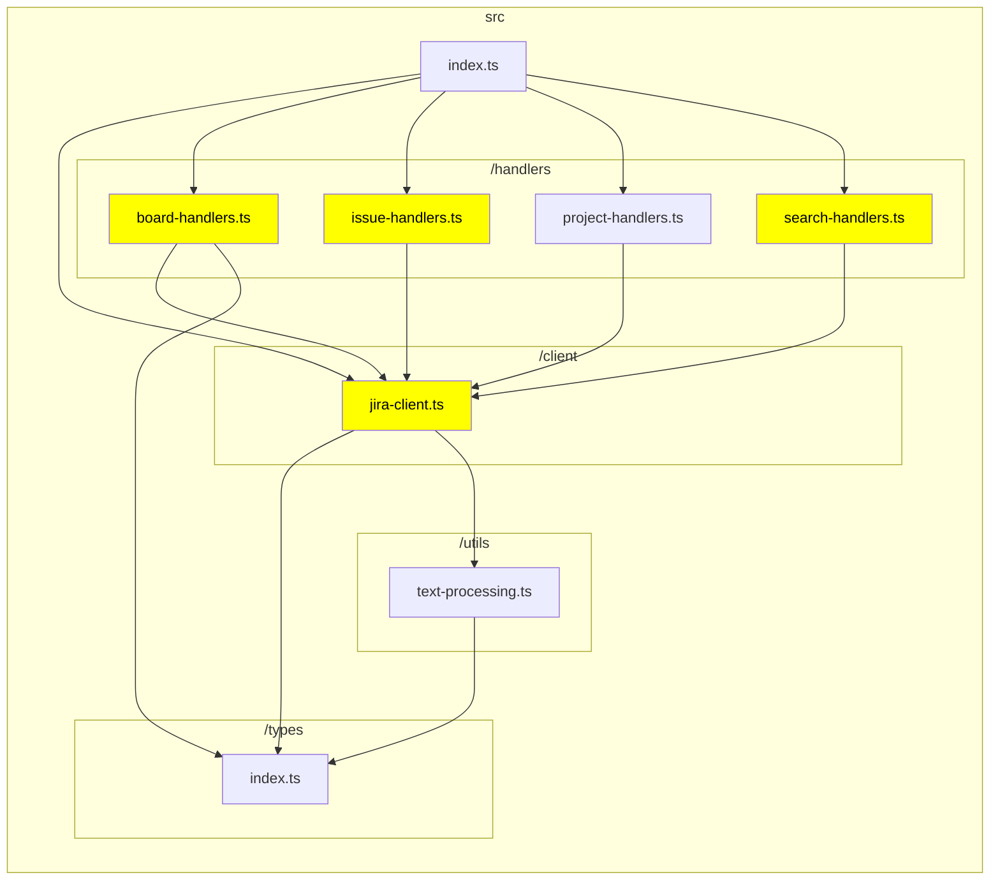

# TypeScript Graph

```bash
tsg --md /home/aaron/mcp/jira-cloud/docs/generated/class-diagram.md --dir /home/aaron/mcp/jira-cloud --include src/client src/handlers src/types --exclude node_modules test tests coverage build --highlight jira-client.ts issue-handlers.ts board-handlers.ts search-handlers.ts --LR
```



