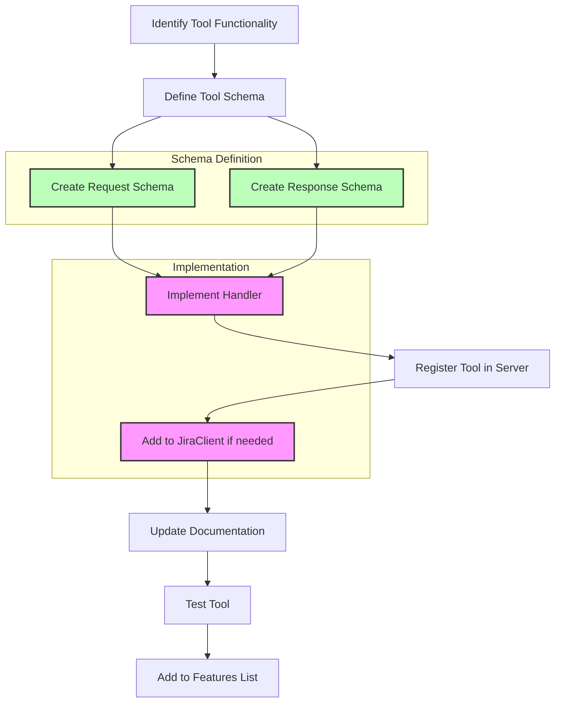
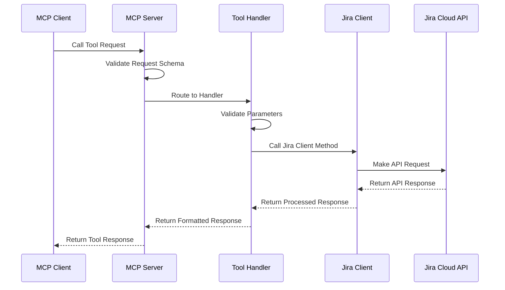
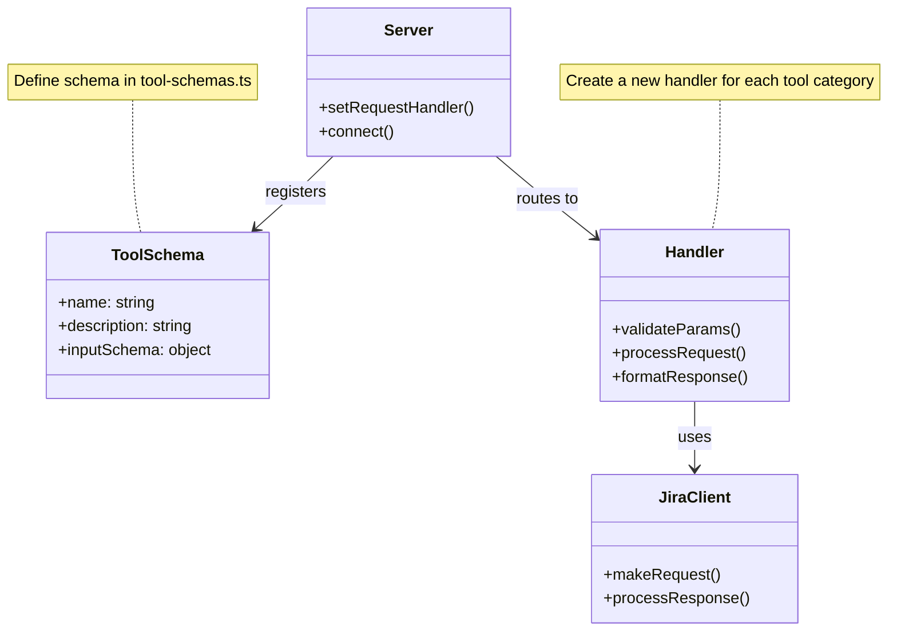

# Tool Development Guide

This guide provides detailed instructions for extending the Jira Cloud MCP Server with new tools. It covers the design patterns, implementation steps, and best practices for adding new functionality to the MCP server.

## Table of Contents

1. [Tool Development Overview](#tool-development-overview)
2. [MCP Tool Architecture](#mcp-tool-architecture)
3. [Step-by-Step Tool Implementation](#step-by-step-tool-implementation)
4. [Testing New Tools](#testing-new-tools)
5. [Example: Adding a New Tool](#example-adding-a-new-tool)
6. [Best Practices](#best-practices)

## Tool Development Overview

The Jira Cloud MCP Server exposes functionality through "tools" that follow the Model Context Protocol (MCP). Each tool represents a specific operation that can be performed with the Jira Cloud API, such as retrieving issue details, searching for issues, or updating an issue.

### Key Components

1. **Tool Schema**: Defines the tool's name, description, and input parameters
2. **Request Handler**: Processes the tool request, validates parameters, and calls the Jira Client
3. **Jira Client Method**: Communicates with the Jira Cloud API
4. **Response Formatting**: Transforms the Jira API response into the expected MCP response format

### Tool Implementation Flow



## MCP Tool Architecture

The MCP tool architecture follows a layered approach:

### MCP Request Processing Flow



### Tool Extension Pattern



## Step-by-Step Tool Implementation

Follow these steps to add a new tool to the Jira Cloud MCP Server:

### 1. Define Tool Schema

Add your tool definition to `src/schemas/tool-schemas.ts`:

```typescript
export const MyNewToolSchema = {
  name: 'my_new_tool',
  description: 'Description of what the tool does',
  inputSchema: {
    type: 'object',
    properties: {
      param1: {
        type: 'string',
        description: 'Description of parameter 1'
      },
      param2: {
        type: 'number',
        description: 'Description of parameter 2'
      }
    },
    required: ['param1']
  }
};
```

### 2. Create Request Schema

Add your request schema to `src/schemas/request-schemas.ts` if needed, or use the existing `CallToolRequestSchema`.

### 3. Implement Handler

Create or update a handler in the appropriate file in the `src/handlers` directory:

```typescript
export async function handleMyNewTool(
  request: CallToolRequest,
  jiraClient: JiraClient
): Promise<CallToolResponse> {
  // Extract parameters
  const { param1, param2 } = request.params.arguments;
  
  // Validate parameters
  if (!param1) {
    throw new McpError(ErrorCode.InvalidParams, 'param1 is required');
  }
  
  try {
    // Call Jira Client
    const result = await jiraClient.myNewOperation(param1, param2);
    
    // Format response
    return {
      content: [
        {
          type: 'text',
          text: JSON.stringify(result, null, 2)
        }
      ]
    };
  } catch (error) {
    // Handle errors
    if (error instanceof McpError) {
      throw error;
    }
    throw new McpError(
      ErrorCode.InternalError,
      `Error executing my_new_tool: ${error.message}`
    );
  }
}
```

### 4. Add to JiraClient (if needed)

If your tool requires new Jira API functionality, add a method to `src/client/jira-client.ts`:

```typescript
async myNewOperation(param1: string, param2?: number): Promise<any> {
  const endpoint = `/api/3/some-endpoint/${param1}`;
  const params = param2 ? { queryParam: param2 } : {};
  
  const response = await this.makeRequest('GET', endpoint, params);
  return this.processResponse(response);
}
```

### 5. Register Tool in Server

Update `src/index.ts` to register your tool:

```typescript
// Register tool handlers
server.setRequestHandler(ListToolsRequestSchema, async () => ({
  tools: [
    // Existing tools...
    MyNewToolSchema
  ]
}));

// Register tool handler
server.setRequestHandler(CallToolRequestSchema, async (request) => {
  // Existing tool handling...
  if (request.params.name === 'my_new_tool') {
    return handleMyNewTool(request, jiraClient);
  }
  // Error handling for unknown tools...
});
```

### 6. Update Documentation

Update the relevant documentation files:
- Add your tool to `docs/features.md`
- Document the tool's functionality in the appropriate section

### 7. Test Your Tool

Test your tool manually to ensure it works as expected.

## Testing New Tools

### Manual Testing

1. Build and run the MCP server
2. Use the MCP client to call your tool
3. Verify the response matches the expected format
4. Test error cases and edge cases

### Automated Testing

Consider adding unit tests for your tool:

```typescript
describe('MyNewTool', () => {
  it('should handle valid parameters', async () => {
    // Test implementation
  });
  
  it('should throw an error for invalid parameters', async () => {
    // Test implementation
  });
});
```

## Example: Adding a New Tool

Let's walk through adding a new tool called `get_jira_issue_links` that retrieves the links between Jira issues.

### 1. Define Tool Schema

```typescript
// src/schemas/tool-schemas.ts
export const GetJiraIssueLinksSchema = {
  name: 'get_jira_issue_links',
  description: 'Get links between Jira issues',
  inputSchema: {
    type: 'object',
    properties: {
      issueKey: {
        type: 'string',
        description: 'The Jira issue key (e.g., PROJ-123)'
      }
    },
    required: ['issueKey']
  }
};
```

### 2. Implement Handler

```typescript
// src/handlers/issue-handlers.ts
export async function handleGetJiraIssueLinks(
  request: CallToolRequest,
  jiraClient: JiraClient
): Promise<CallToolResponse> {
  const { issueKey } = request.params.arguments;
  
  if (!issueKey) {
    throw new McpError(ErrorCode.InvalidParams, 'issueKey is required');
  }
  
  try {
    const issueLinks = await jiraClient.getIssueLinks(issueKey);
    
    return {
      content: [
        {
          type: 'text',
          text: JSON.stringify(issueLinks, null, 2)
        }
      ]
    };
  } catch (error) {
    if (error instanceof McpError) {
      throw error;
    }
    throw new McpError(
      ErrorCode.InternalError,
      `Error getting issue links: ${error.message}`
    );
  }
}
```

### 3. Add to JiraClient

```typescript
// src/client/jira-client.ts
async getIssueLinks(issueKey: string): Promise<any> {
  const endpoint = `/rest/api/3/issue/${issueKey}`;
  const params = { fields: 'issuelinks' };
  
  const response = await this.makeRequest('GET', endpoint, params);
  return response.data.fields.issuelinks;
}
```

### 4. Register Tool in Server

```typescript
// src/index.ts
server.setRequestHandler(ListToolsRequestSchema, async () => ({
  tools: [
    // Existing tools...
    GetJiraIssueLinksSchema
  ]
}));

server.setRequestHandler(CallToolRequestSchema, async (request) => {
  // Existing tool handling...
  if (request.params.name === 'get_jira_issue_links') {
    return handleGetJiraIssueLinks(request, jiraClient);
  }
  // Error handling for unknown tools...
});
```

## Best Practices

### Tool Design

1. **Single Responsibility**: Each tool should do one thing well
2. **Clear Naming**: Use descriptive names that follow the pattern `verb_noun`
3. **Comprehensive Documentation**: Document all parameters and return values
4. **Error Handling**: Provide clear error messages for all failure cases

### Parameter Validation

1. **Required Parameters**: Always validate required parameters
2. **Type Checking**: Validate parameter types
3. **Constraints**: Check any constraints on parameter values
4. **Error Messages**: Provide clear error messages for validation failures

### Response Formatting

1. **Consistent Structure**: Follow the MCP response format
2. **Useful Content**: Provide useful information in the response
3. **Error Handling**: Handle errors gracefully and provide useful error messages

### Code Organization

1. **Modular Design**: Keep related functionality together
2. **Separation of Concerns**: Separate validation, business logic, and response formatting
3. **Reusable Components**: Create reusable functions for common operations
4. **Consistent Patterns**: Follow the established patterns in the codebase

Last updated: 2025-03-07 at 12:56:09
