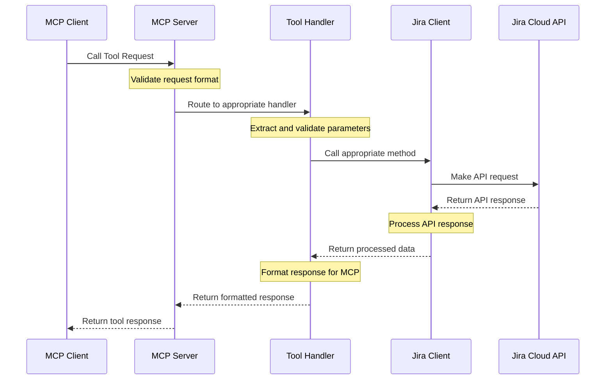
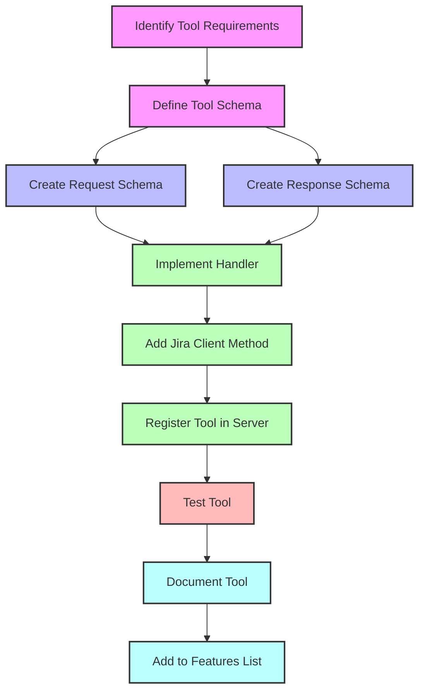
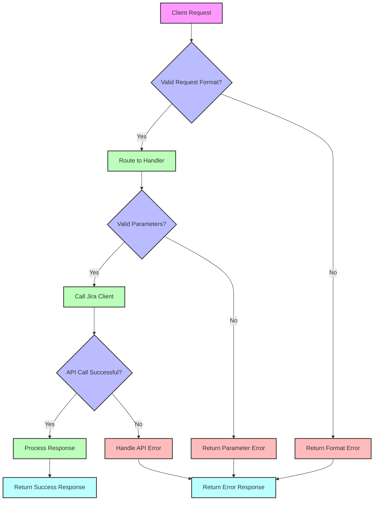
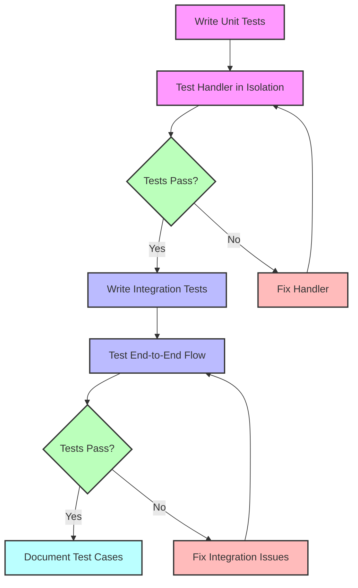
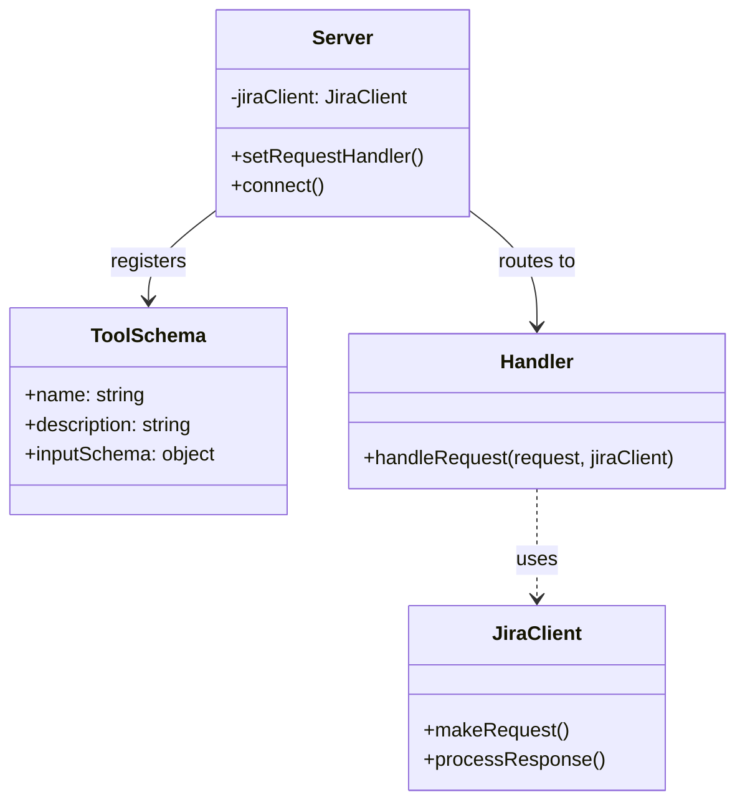
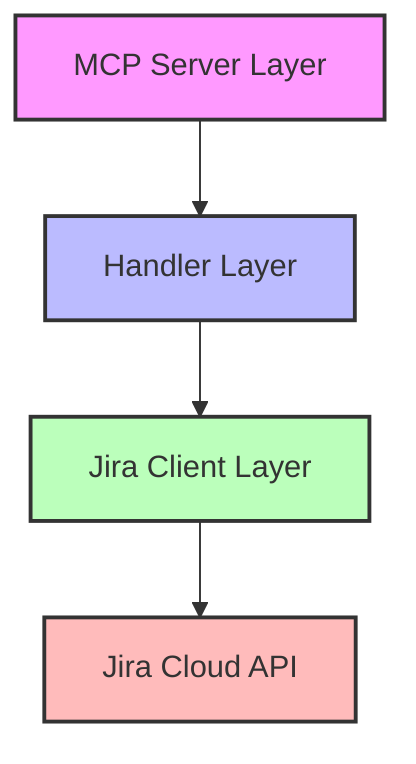

# MCP Workflow Diagrams

This document provides visual workflow diagrams that illustrate the key processes in the Jira Cloud MCP Server, with a focus on how to extend the server with new tools.

## Table of Contents

1. [Introduction](#introduction)
2. [MCP Request Processing Workflow](#mcp-request-processing-workflow)
3. [Tool Development Workflow](#tool-development-workflow)
4. [Error Handling Workflow](#error-handling-workflow)
5. [Testing Workflow](#testing-workflow)

## Introduction

These workflow diagrams are designed to help developers understand the flow of data and control in the Jira Cloud MCP Server. They complement the written documentation by providing visual representations of key processes.

## MCP Request Processing Workflow

This diagram illustrates how a request flows through the MCP server:

## Tool Development Workflow

This diagram illustrates the process of developing a new tool for the MCP server:

## Error Handling Workflow

This diagram illustrates how errors are handled in the MCP server:

## Testing Workflow

This diagram illustrates the testing workflow for the MCP server:

## Tool Extension Pattern

This diagram illustrates the pattern for extending the MCP server with new tools:

## MCP Tool Architecture

This diagram illustrates the layered architecture of the MCP server:

Last updated: 2025-03-07 at 13:12:19
